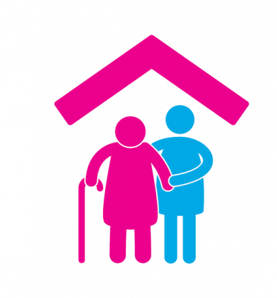

# MySahara 
*"A GPS Based Tracking System"*

MySahara is an Android Application to communicate at the tracker (family member) and the trackee (senior) end, with emergency call / messaging options as well as get directions to the trackee. Notifications generated if the trackee exits the set geofence.

This project was a part of the 'Network Programming Lab' course, 2018. 

License
-------

This project is licensed under the [MIT] license.

[MIT]: LICENSE
[logo]: /app/src/main/res/drawable/logo.png
